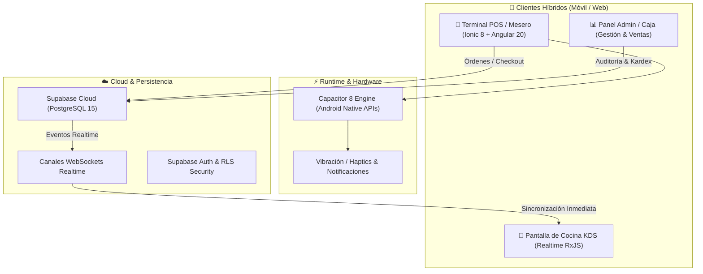

# 🍔 Donde Kike POS & Comandas Móviles

> **Sistema Híbrido de Punto de Venta (POS), Comandas en Tiempo Real y Control de Inventarios para Restaurantes y Comidas Rápidas.**  
> *Desarrollado bajo la titularidad y autoría del **Ingeniero Owen Badel Hooker**.*

[](https://www.linkedin.com/in/owen-badel-175851371/)
[](https://angular.dev/)
[](https://ionicframework.com/)
[](https://supabase.com/)
[](https://developer.android.com/)

---

## 📌 Descripción del Sistema

**Donde Kike POS** es una solución integral de ingeniería de software diseñada para optimizar los flujos operativos y de atención en establecimientos gastronómicos y restaurantes de comida rápida. Combina una aplicación móvil táctil para camareros y personal de salón, una pantalla operativa de comandas sincronizada en tiempo real con cocina, y un panel administrativo para caja, ventas e inventario.

El sistema fue concebido como una solución híbrida (Cross-Platform) capaz de compilarse nativamente para dispositivos móviles **Android** mediante **Capacitor 8**, o desplegarse como una **Aplicación Web Progresiva (PWA)** de alto rendimiento.

---

## 🏛️ Arquitectura & Tecnologías



* **Frontend:** Angular 20 Standalone Components, Ionic Framework 8, SCSS Theming modular y RxJS para manejo reactivo del estado.
* **Móvil Nativo:** Capacitor 8 con plugins de hardware para Android (`@capacitor/haptics`, `@capacitor/camera`, `@capacitor/filesystem`).
* **Backend & Base de Datos:** Supabase (PostgreSQL 15) con suscripciones en tiempo real mediante WebSockets y Row-Level Security (RLS).
* **Auditoría & Facturación:** Esquema relacional estricto con soporte para comandas, estados de preparación, historial de transacciones y cálculo automático de totales.

---

## 🚀 Módulos Funcionales

1. **Terminal POS & Cobro Rápido:**
   - Selección táctil y categorizada del menú (hamburguesas, perros calientes, bebidas, combos).
   - Carrito reactivo con cálculo inmediato de subtotal, impuestos y descuentos.
   - Modal de checkout con selección de medio de pago y generación de comprobante.

2. **KDS de Cocina en Tiempo Real (Kitchen Display System):**
   - Recepción instantánea de órdenes sin necesidad de refrescar la pantalla.
   - Cambio de estado de preparación (*Pendiente*, *En Preparación*, *Listo para Servir*, *Entregado*).
   - Tiempos de preparación y alertas visuales de pedidos demorados.

3. **Control de Inventarios & Stock:**
   - Registro de productos, categorías, precios de venta y costos unitarios.
   - Control de existencias con alertas visuales de agotamiento o stock mínimo.

4. **Dashboard Administrativo & Reportes:**
   - Métricas de ventas diarias, productos más vendidos y promedio por ticket.
   - Registro histórico de facturas y auditoría de pedidos.

5. **Control de Acceso Basado en Roles (RBAC):**
   - Perfiles de usuario: *Administrador*, *Cajero*, *Mesero* y *Cocinero*.
   - Guards de navegación para protección estricta de rutas y vistas.

---

## 🛠️ Instalación y Puesta en Marcha

### Prerrequisitos
* **Node.js:** Versión 18.x o 20.x LTS.
* **Angular CLI:** `npm install -g @angular/cli`.
* **Ionic CLI:** `npm install -g @ionic/cli`.
* **Android Studio:** (Opcional, para compilación de APK en Android).

### 1. Clonar e Instalar Dependencias
```bash
git clone https://github.com/OwenBadel/DondeKike.git
cd DondeKike
npm install
```

### 2. Configurar Entorno
Editar las credenciales de Supabase en `src/environments/environment.ts`:
```typescript
export const environment = {
  production: false,
  supabaseUrl: 'TU_SUPABASE_URL',
  supabaseAnonKey: 'TU_SUPABASE_ANON_KEY'
};
```

### 3. Ejecutar en Modo Desarrollo (Navegador)
```bash
ionic serve
```

### 4. Compilar y Ejecutar en Android
```bash
ionic build
npx cap sync android
npx cap open android
```

---

## 👨‍💻 Autoría y Créditos

* **Ingeniero Titular y Diseñador de Software:** Owen Badel Hooker
* **Formación:** Ingeniería de Sistemas — Fundación Universitaria Colombo Internacional (Unicolombo)
* **GitHub:** [@OwenBadel](https://github.com/OwenBadel)
* **LinkedIn:** [linkedin.com/in/owen-badel-175851371](https://www.linkedin.com/in/owen-badel-175851371/)
* **Contacto Directo:** [+57 301 645 0065](https://wa.me/573016450065)
